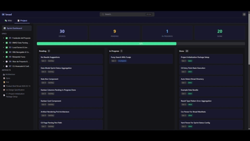

# bmad-viewer

**Stop wasting tokens asking "where am I?"** — see your BMAD project status, browse the full agent/workflow catalog, and search everything with Ctrl+K. Zero tokens, zero config.



## The problem

BMAD is powerful — 21 agents, 43 workflows, hundreds of resources. But:

- **New users** face 500+ markdown files with no map
- **Active developers** burn tokens every morning asking the agent "where did I leave off?"
- **Non-technical stakeholders** can't see project progress without opening a terminal
- **Solo devs** don't know half the capabilities BMAD offers

bmad-viewer fixes all of that with a single command.

## Quick start

**From Claude Code** — just type:

```
/viewer
```

The package includes a `/viewer` slash command that auto-installs as a skill. Claude launches the dashboard for you in the background.

**From terminal:**

```bash
npx bmad-viewer
```

Auto-detects your `_bmad/` folder, opens your browser, dashboard ready.

## What you get

**Wiki / Catalog** — Browse all BMAD modules (Core, BMB, BMM, CIS) with a navigable sidebar. Click any agent or workflow to read its full description rendered as clean HTML.

**Project Viewer** — Sprint status at a glance: stats boxes + kanban columns (Pending → In Progress → Done). Reads directly from your `sprint-status.yaml`. Auto-refreshes when files change on disk.

**Fuzzy Search (Ctrl+K)** — Find any agent, workflow, or tool instantly. Tolerates typos. You type "brainstrom", you get "brainstorming".

**Dark/Light theme** — Respects your OS preference, toggle manually anytime. Persists across sessions.

## Who is this for

| You are... | You get... |
|------------|-----------|
| New to BMAD | A visual map of everything BMAD offers — no more guessing which agent does what |
| A developer mid-sprint | Sprint dashboard on your second monitor, always up to date, zero tokens spent |
| A solo dev | Discover workflows you didn't know existed via search |
| A stakeholder | A shareable link with project progress — no terminal needed |
| An open source contributor | A complete catalog to understand how BMAD fits together |

## CLI options

```
bmad-viewer [options]

Options:
  --port <number>       Custom port (default: auto-detect from 3000)
  --path <directory>    Path to BMAD project (default: auto-detect _bmad/ in cwd)
  --output <directory>  Generate static HTMLs (no server)
  --no-open             Don't open browser automatically
  --version             Show version
  --help                Show help
```

## How it works

bmad-viewer reads the files BMAD already generates — CSV manifests, YAML configs, Markdown docs — and renders them as a local HTML dashboard. The filesystem is the database. No backend, no data entry, no sync.

When you edit a file, a file watcher detects the change and pushes an update to your browser via WebSocket. The dashboard refreshes automatically.

## Requirements

- Node.js 18+ (LTS)
- A project with BMAD installed (`_bmad/` folder)

## Try without a BMAD project

```bash
npx bmad-viewer --path ./node_modules/bmad-viewer/example-data
```

Bundled example data lets you explore the dashboard without a real project.

## Contributing

Issues and PRs welcome at [github.com/CamiloValderramaGonzalez/bmad-viewer](https://github.com/CamiloValderramaGonzalez/bmad-viewer).

## License

MIT
