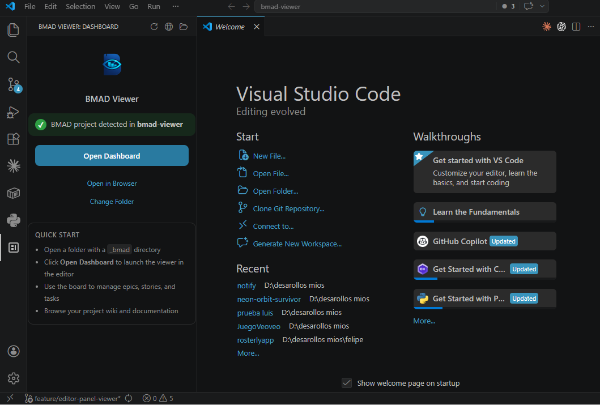
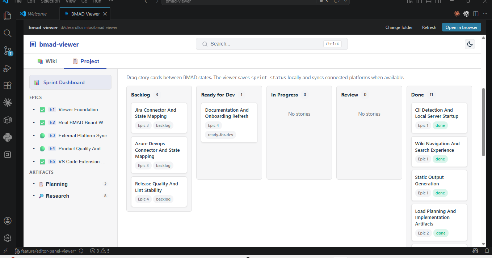

# BMAD Viewer VS Code Extension

Open the BMAD dashboard inside VS Code, backed by the same local BMAD workspace and sync capabilities that power the standalone viewer.

## Screenshots

### Sidebar navigation with project detection


### Full dashboard in the editor panel


## Features

- **Activity Bar integration** — Dedicated BMAD Viewer icon in the VS Code sidebar for quick access.
- **Automatic project detection** — Detects `_bmad/` folders in your workspace automatically.
- **Full editor dashboard** — Opens the complete BMAD Viewer in the main editor area, not cramped in a small panel.
- **Kanban board** — Drag-and-drop board with Backlog, Ready for Dev, In Progress, Done, and Blocked columns.
- **Epic and story management** — Browse and manage epics, stories, and tasks directly from VS Code.
- **Project wiki** — Access your project documentation, product briefs, and technical specs without leaving the editor.
- **Sprint dashboard** — View sprint progress, status, and planning at a glance.
- **Search** — Full-text search across your BMAD project (Ctrl+K).
- **Quick start guide** — Built-in sidebar guide to get started in seconds.
- **Open in browser** — Launch the dashboard in your default browser for a wider view.
- **Multi-folder workspaces** — Switch between multiple BMAD projects in multi-root workspaces.
- **Configurable port** — Set your preferred localhost port for the embedded server.
- **Auto-open on startup** — Optionally open the dashboard automatically when VS Code starts.
- **Light and dark theme support** — Adapts to your VS Code theme.
- **Platform sync** — Sync stories and tasks with GitHub Issues (Jira and Azure DevOps coming soon).

## Getting started

1. Install the extension from the [VS Code Marketplace](https://marketplace.visualstudio.com/items?itemName=rdudiver.bmad-viewer-vscode).
2. Open a folder that contains a `_bmad/` directory.
3. Click the BMAD Viewer icon in the Activity Bar.
4. Click **Open Dashboard** to launch the full viewer in the editor.

## Extension settings

| Setting | Default | Description |
|---------|---------|-------------|
| `bmadViewer.openOnStartup` | `false` | Open the dashboard automatically when VS Code starts with a workspace |
| `bmadViewer.preferredPort` | `4100` | Preferred localhost port for the embedded server |

## Commands

| Command | Description |
|---------|-------------|
| `BMAD Viewer: Open Dashboard` | Open the full dashboard in the editor panel |
| `BMAD Viewer: Refresh` | Refresh the dashboard and sidebar |
| `BMAD Viewer: Open In Browser` | Open the dashboard in your default browser |
| `BMAD Viewer: Select Workspace Folder` | Choose which workspace folder to use |

## Local development

```bash
cd apps/vscode-extension
npm install
npm run check
npm run package:vsix
```

Install locally with:

```bash
code --install-extension bmad-viewer-vscode-*.vsix
```

## CI/CD

The GitHub Actions workflow at `.github/workflows/vscode-extension.yml`:

- Packages the extension on pull requests and pushes to `master`
- Uploads the generated `.vsix` as a workflow artifact
- On merge to `master`: auto-bumps the patch version, publishes to the Marketplace, commits the version bump, and creates a git tag
